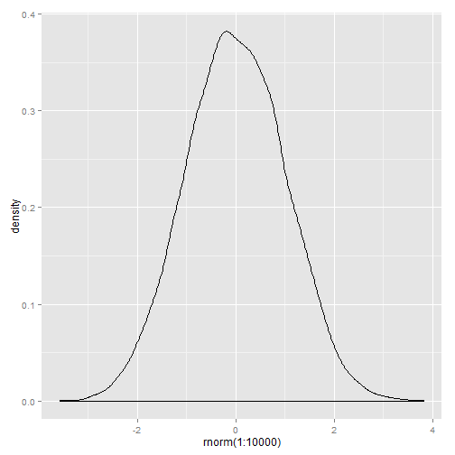

Taming of Chance Story Compilation
========================================================

In the not so distant future, the Gaussians and antiGausses engage in a century long war of attrition. Artificial intelligence developed in the 22nd century and gained conciousness. It took only hours for the robots to take over the world, hijacking the internet and destablizing society. Mankind realized that they had only one option to topple their evil metalic overlords. They needed to travel back in time and derail the advance of technology in the most monumental was imaginable: erase the normal curve from history...**DUN DUN DUNNNN**


```r
summary(cars)
```

```
##      speed           dist    
##  Min.   : 4.0   Min.   :  2  
##  1st Qu.:12.0   1st Qu.: 26  
##  Median :15.0   Median : 36  
##  Mean   :15.4   Mean   : 43  
##  3rd Qu.:19.0   3rd Qu.: 56  
##  Max.   :25.0   Max.   :120
```


```r
plot(cars)
```

 


This was all until a Katniss Everdeen type character arose (okay, it literally actually is Katniss Everdeen) from the gutters of Plyr city. Since there were over \Sexpr{sample(1000:10000,1)} people in her running crew and they were very poor she needed to get a job. However, she had terrifically high self-esteem and thought that she could do more with her life than hang out around the block so she began to learn how to perform rap music. Her hip-hop songs were so good that giggly graduate students would all hunch together and click away on her web videos.

This was all until a Katniss Everdeen type character arose from the gutters of Plyr city. Since there were over 1894 people in her family and they were very poor she needed to get a job. However, she had terrifically high self-esteem and thought that she could do more with her life than hang out around the block so she began to learn how to perform rap music. Her hip-hop songs were so good that giggly graduate students would all hunch together and click away on her web videos.
So she decided to time-travel to make really awesome web video. This lead to her discovering the normal curve:
<!-- chunk-label: R code (No Results in Document) -->

```r
require(ggplot2)
```

```
## Loading required package: ggplot2
```

```r
qplot(rnorm(1:10000), geom = "density")
```

 


People knew that she was something classic like some kind of heroine archetype this leads the main conflict of the story. Ultimately this will turn out good. The story will be very interesting. The story will be compelling and people will like it.
